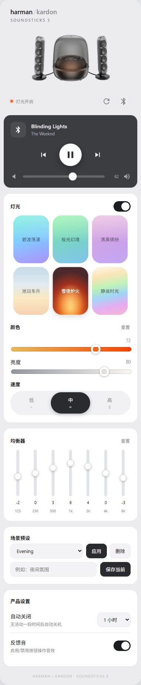

# SoundSticks 5 for Home Assistant

[English](README_EN.md) | 简体中文

Harman Kardon SoundSticks 5 的非官方 Home Assistant 本地 BLE/GATT 控制集成。

本项目与 Harman Kardon 或 HARMAN International 没有隶属、授权、赞助或背书关系。当前协议主要来自普通版 SoundSticks 5、HK One 2.5.4 和一台测试设备；地区、SKU 和固件差异仍可能存在。

## 功能

- Home Assistant Bluetooth 自动发现，不保存历史 MAC/RPA；
- 灯光开关、`0..100` 亮度、六种灯效、速度、当前灯效颜色和单灯效颜色重置；
- 七段 App 刻度 EQ 与全零重置；
- 反馈音、自动关闭配置和剩余时间；
- BLE 媒体播放/暂停/上一曲/下一曲、绝对音量、曲名和歌手状态；
- 一键拉取全量状态、一键释放 GATT 控制连接；
- GATT 串行访问、通知订阅、媒体动作后回读、超时/退避重试、诊断信息；
- 中英文界面、HACS 元数据和 CI。

这里的 Lighting 只表示灯光，不是音箱电源。BLE 收到媒体命令 ACK 也不等于播放器已经执行；集成会在媒体命令后读取聚合状态。A2DP 音频传输和唤醒不属于本集成的用户功能范围，可配合 Music Assistant 支持的成熟蓝牙音频方案使用。

## 安装

**第一次使用请看：[从安装集成到配置 Lovelace 卡片](docs/getting-started.md)**，包含默认配置、播放源选择、预设和常见问题。

详细步骤见 [安装文档](docs/installation.md)。最简流程：

1. 用 HACS 自定义仓库安装，或把 `custom_components/soundsticks5` 复制到 `/config/custom_components/`。
2. 重启 Home Assistant。
3. 唤醒音箱，在“设置 → 设备与服务”接受 Bluetooth 发现，或手动添加 SoundSticks 5。

普通用户只需要一个由 HA 主机管理的蓝牙适配器。BLE 与经典蓝牙是两个独立协议层，但设计上允许共用同一个物理适配器。实际并发能力仍取决于适配器、BlueZ、代理类型和音箱状态。

## 自定义卡片

本仓库提供随集成安装的 [SoundSticks 5 自定义卡片](soundsticks5-card/README.md)，包含灯效、音量、EQ、预设和播放源选择。支持指定媒体实体、自动或仅 BLE 模式。卡片和图片随集成一起安装和更新，界面管理资源时自动注册，刷新浏览器后即可添加卡片。YAML 资源配置见入门指南。

380px 窄版完整预览（0.9.1，示例状态）：

## 实体

| 分组 | 实体 |
|---|---|
| Media | 媒体播放器：播放、暂停、上下曲、`0..100` 音量和设备回报的媒体信息 |
| Lighting | 灯光、主题、速度、当前主题颜色、颜色重置 |
| EQ | 125/250/500/1000/2000/4000/8000 Hz、EQ 重置 |
| Device settings | 反馈音、自动关闭、剩余时间 |
| Session | 刷新全部状态、释放 BLE 控制 |
| Diagnostics | BLE 状态、RSSI、最近错误类型 |

完整说明和刻度映射见 [实体文档](docs/entities.md)。

## 安全与范围

没有任意 GATT 写接口，也不实现 OTA、固件传输、恢复出厂、解绑或未知命令。诊断会遮蔽 BLE 地址、API token、媒体 URL、曲名和歌手。附近设备的名称、地址和 manufacturer data 不会上传。

固件版本目前只在官方 App UI 中观察到，尚无安全、稳定且已确认的 BLE 查询，因此没有伪造一个 firmware 实体。重命名虽已有确认帧，但本版本没有提供实体，因为缺少同等可靠的读回与缓存语义。

## 状态

协议编码、解析、状态合并、连接生命周期和实体行为有自动化测试。不同 HA 蓝牙适配器、远程代理及固件组合仍需持续验证，请见 [验证状态](docs/validation.md)。

协议证据和复现工具位于 [soundsticks5-protocol](https://github.com/neqq3/soundsticks5-protocol)。问题报告请附普通版/地区/SKU/固件、HA 安装类型和蓝牙路径，但不要公开设备序列号。

## 许可证

Apache License 2.0，见 [LICENSE](LICENSE)。
